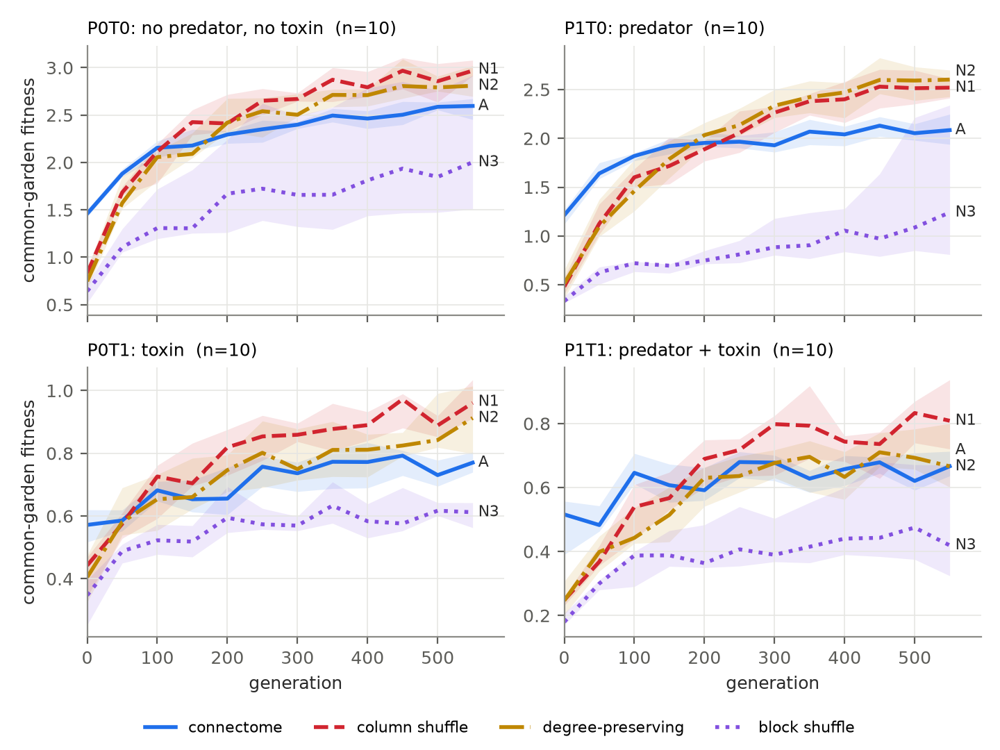
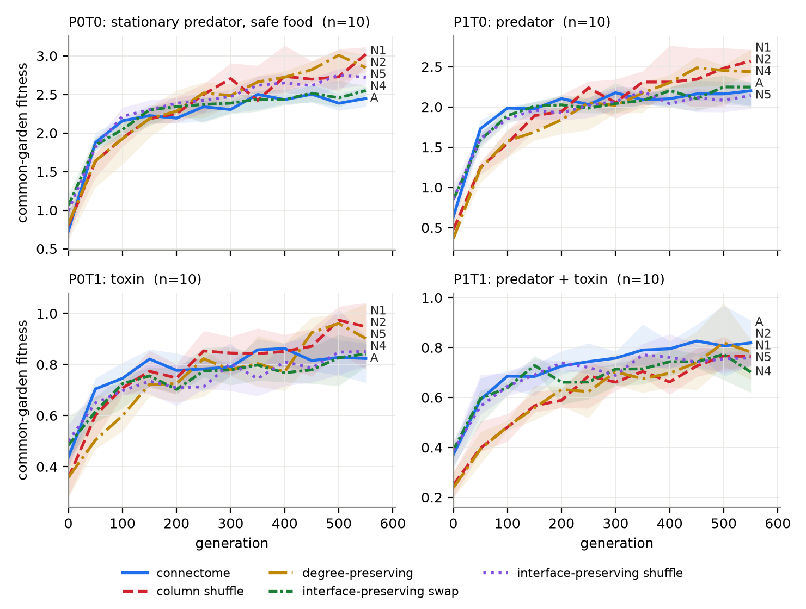
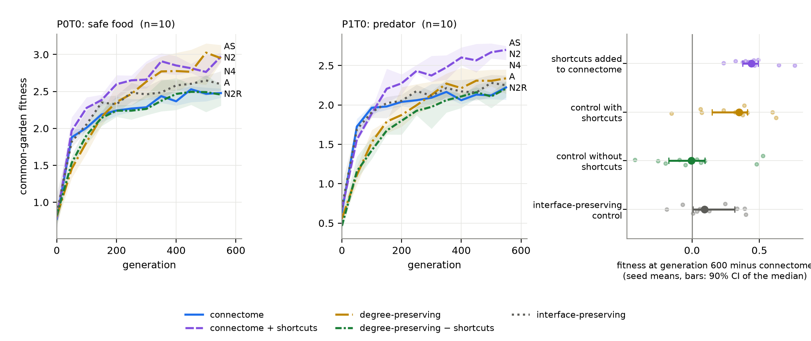
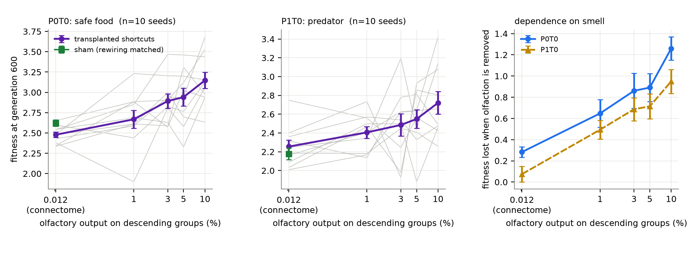

# Null-model treatment of the sensory-motor boundary changes an evolutionary connectome comparison

**Gyujeong Park**, Independent Researcher. ORCID 0009-0006-2989-728X. Correspondence: <ionlabs2025@gmail.com>

**Version.** v4.1 preprint, 2026-09-23. Frozen protocols: `PROTOCOL.md` (paper-v1), `PROTOCOL_ECO.md` (first grid), `PROTOCOL_MUT.md` (mutational neighbourhood), `PROTOCOL_FIX.md` with amendment 1 (corrected grid), `PROTOCOL_SWAP.md` (rewiring intervention), `PROTOCOL_DOSE.md` (dose-response and sham). Engine SHA-256 prefixes: first grid `601866b4234dc673` (`evo_paper.py`), corrected grid `c0adad2f709e93b0` (`evo_fix.py`), intervention `98c0b5f96f4749a8` (`evo_swap.py`), dose-response `dc27fa100d16d8a7` (`evo_dose.py`), assays `047551721ea79579` (`evo_noise.py`), `4a73ecf336d92946` (`evo_mut.py`), `38c9fdb607129906` (`evo_int.py`). Brain data `2781469e0524f33c`. Supplement: `SUPPLEMENTARY.md`. Changes from v3.2: the dose-response and sham experiment (§3.5) is new, and end-of-run numbers that v3.2 labelled "generation 600" are relabelled to the last common-garden probe at generation 550, which is where they were always measured (§2.6). Changes from v4.0, all from a line-by-line audit of every number against its source and none changing a conclusion: the dose sizes and swap counts in §3.5 were seed-0 values presented as general and are now ranges over the ten seeds; the full dose and the sham rewire comparable rather than equal amounts, which §3.5 now shows strengthens the comparison; the interior overlap of the boundary-preserving nulls is 0.09 to 0.12, not 0.10 to 0.12; and the mutational-neighbourhood interval statement is corrected (§3.1). Values that v4.0 quoted without a saved source are now written by `make_paper_numbers.py` to `results/paper_numbers.json`.

---

## Abstract

Whether a measured connectome outperforms a randomised copy of itself depends on which properties the randomisation preserves. Here we report a case in which one such property, the boundary between sensory and motor neurons, decides the outcome of an embodied evolutionary comparison.

Agents whose brain is a compressed adult *Drosophila* FlyWire v783 connectome (512 cell-type groups, 1,000 individually wired Kenyon cells, dopamine-gated plasticity) foraged and evolved for 600 generations in four pre-registered ecologies, alongside identically evolved populations built on randomised wiring. Two randomisations in common use, a presynaptic-column shuffle and degree-preserving edge swaps, move 10.6 to 10.7 % of olfactory receptor output directly onto descending motor groups; in the compressed connectome that share is 0.012 %, and 52 of 53 descending groups are two or more synapses away from olfactory input. Against these controls the connectome populations end behind at the last common-garden probe, generation 550 (−0.22 and −0.20 fitness units on seed means, p_holm = 0.029 and 0.016), although on the pre-registered primary endpoint, fitness averaged over the run, no difference is detected against any control.

Against controls that preserve every edge leaving a sensory group and every edge entering a motor group and randomise only the interior, the difference at the last probe on seed means lies inside a ±0.10 equivalence bound: +0.002 (90 % CI −0.026 to +0.045) against interior degree-preserving swaps and −0.074 (90 % CI −0.096 to +0.002) against an interior column shuffle. Per ecology the estimates vary, and in the safe-food ecology the interior column shuffle remains ahead by 0.26 (p_holm = 0.029). A rewiring intervention supports the shortcut explanation: adding olfactory-to-motor shortcuts to the connectome by degree-preserving swaps raises its fitness at the last probe by +0.44 (10 of 10 seeds, p = 0.002) and its dependence on olfaction from 0.15 to 0.99, and the effect grows over evolution (+0.40, 10 of 10 seeds); removing the shortcuts from the degree-preserving control costs it 0.43 fitness in the ecology where it had a clear advantage (p = 0.004). A sham that performs 101 degree-preserving swaps without touching the shortcut share separates the two: the full shortcut dose, which took 68 to 129 swaps depending on the seed, is ahead of it by 0.534 (90 % CI +0.377 to +0.700, 10 of 10 seeds), including all seven seeds in which it used fewer swaps than the sham, so the amount of rewiring does not account for the effect. Graded doses of 1, 3, 5 and 10 % raise fitness in step (p = 1.4 × 10⁻⁶) and raise dependence on olfaction with it, while being indistinguishable before evolution. The sham was registered to show no effect and did not, crossing the equivalence bound and changing sign between ecologies, so rewiring in general contributes something too, smaller and less stable. Scrambling interior wiring costs every condition 46 to 55 % of its fitness, so the evolved agents do not run on a reflex arc alone.

A one-sided noise term in our motor model, found after pre-registration, had produced an apparent generation-0 advantage for the connectome; all results above come from re-runs with the term corrected, and the original runs are reported for comparison. In this model, then, the choice of what a null preserves at the sensory-motor boundary changes the end-of-run comparison, and calibrated sensory-to-motor path statistics are worth reporting next to the degree statistics a null preserves.

---

## 1. Introduction

Whole-brain wiring diagrams of the adult fly are public (Dorkenwald et al., 2024; Schlegel et al., 2024), and models built on them reproduce feeding circuits (Shiu et al., 2024), visual responses (Lappalainen et al., 2024) and locomotion (Vaxenburg et al., 2025). Whether the measured wiring is better than chance is usually tested by comparing it with a randomised network that preserves some of its statistics.

Answers differ, and the choice of null model is part of the reason. A null preserves some properties of the empirical network and randomises the rest, and the result of a comparison is a statement about the properties that were randomised (Váša & Mišić, 2022). Degree-preserving rewiring is the usual default, and for connectomes it is known to miss structure that spatial constraints capture (Salova & Kovács, 2025). For the fly specifically, Worrell et al. (2017) compared sensor-to-effector spreading in the *Drosophila* connectome against degree-preserving nulls and found the empirical wiring faster. Dhiman (2026) trained a connectome-constrained model of the fly visual system and found that its advantage over degree-preserving rewired networks largely disappears once both start from a shared random initialisation, a case where switching nulls changed the verdict through initialisation and degree effects rather than through path structure. Cho (2026) released a benchmark of 31 behavioural tasks for whole-connectome simulations with shuffled and degree-preserving controls. These studies compare networks that already exist; we asked what happens to measured wiring under selection.

Our first pre-registered experiment found that randomised wiring out-evolves the connectome. Following that result up showed that the two standard randomisations we had used move about a tenth of olfactory receptor output directly onto descending motor neurons, a class of connection that carries only 0.012 % of calibrated olfactory output in the compressed connectome. That is not an error in those nulls; it is what randomising the wiring between sensory and motor neurons does. But in an embodied task where a short reactive route is useful, it changes what the comparison measures. This paper reports what happened when the null preserved the sensory-motor boundary instead, and an intervention that moves the shortcut in and out.

Contributions:

1. A measurement of how much two standard randomisations change the sensory-to-motor boundary of a connectome-derived agent: 0.012 % of calibrated olfactory output reaching descending groups directly in the connectome, 10.6 to 10.7 % after randomisation, with the median shortest-path length from olfactory receptors across descending groups falling from three synapses to one.
2. A pre-registered 40-run comparison against boundary-preserving nulls, built by applying the standard practice of constraining a null to the property under test (Váša & Mišić, 2022) to the sensory-motor boundary. The connectome's end-of-run disadvantage falls inside a ±0.10 equivalence bound on seed means against them, and its apparent sensory-strategy difference shrinks five- to ninefold and no longer survives correction.
3. A pre-registered intervention showing that shortcut-creating rewiring raises evolved fitness in the connectome and transfers the olfactory strategy to it, with the effect growing over evolution, while shortcut-removing rewiring costs the control its advantage in the ecology where it had one.
4. A pre-registered dose-response over four shortcut sizes, monotonic in both fitness and olfactory dependence, with a sham that rewires about as much as the full dose (101 swaps against 68 to 129): the full dose is ahead of it by 0.534 fitness units in 10 of 10 seeds, including every seed in which it rewired less, while the sham itself is worth 0.034 over the connectome, and the sham's registered equivalence prediction failed, so rewiring alone is not inert either.

A one-sided noise term in our motor model was found after pre-registration and corrected; §2.7 states what it affected and what replaced those results.

---

## 2. Methods

All quantities are dimensionless simulation units; the arena is the unit square; a lifetime is T = 400 Euler steps of Δt = 1.

### 2.1 Brain model

**Compression.** From FlyWire v783 we drop optic-lobe, visual-centrifugal and photoreceptor classes, group the remaining neurons by cell type × hemisphere (mushroom-body output, dopaminergic and MBIN types merged across hemispheres), and keep K = 512 groups. A mandatory set is kept first: 16 olfactory receptor-neuron types including the CO₂ channel ORN_V; sugar and bitter gustatory receptor neurons; every antennal-lobe projection-neuron group receiving at least 5 % of its input from kept ORNs plus the 24 most ORN-driven local-neuron groups; mushroom-body output, dopaminergic and modulatory neurons; APL and DPM; the looming detectors LC4 and LPLC2; the descending neurons DNa01, DNa02, DNp09, MDN, DNp01, DNg11, DNg12_a; the 48 highest-scoring groups on a gustatory-to-dopaminergic path score; PFL3 output targets and the path from them to DNa01/DNa02. Remaining slots go to the highest scores on

  score(i) = f(i)·b(i),  f = Σ_{h=1..4}(T^h 1_sensory)(i),  b = Σ_{h=1..4}((Tᵀ)^h 1_descending)(i),  T = D⁻¹ S_abs,

with S_abs the group-level absolute synapse-count matrix and D its row sums. Weights are W⁰_ij = S_signed,ij / (Σ_k S_abs,ik + 1) with neurotransmitter-predicted signs (Eckstein et al., 2024). Sensory rows are zeroed, so sensors act as transducers. The resulting matrix has 14,989 non-zero entries.

The compression keeps named sensory and motor pathways on purpose, and the read-outs start from named descending neurons, so the comparison is between agent designs that share this connectome-derived boundary and differ in the wiring between the two sides of it.

**Dynamics.** With group rates r ∈ ℝ^K, size factors c = exp(s), leak α = σ(a − 1), bias b, sensor vector S ∈ ℝ⁴⁰ with gains g_in and fixed projection B_in from sensor channels onto their receptor groups, Kenyon-cell rates k, plastic KC→MBON matrix W_km, fixed KC→group matrix W_ko and MBON one-hot map P_MB:

  x = W (r ⊙ c) + W_ko k + P_MB (W_km k) + B_in (S ⊙ g_in) + b
  r ← (1 − α) ⊙ r + α ⊙ tanh(max(x, 0))

1,000 Kenyon cells keep their measured projection-neuron inputs W_pk (10.3 non-zero group inputs each). With u = g_kc · W_pk (r ⊙ c), k = tanh(max(u − (mean(u) + λ·SD(u)), 0)) with heritable λ, an APL-like inhibition keeping 7 to 9 % of Kenyon cells active. Plasticity is dopamine-gated: d = M_DAN r_DAN, d̄ ← 0.95 d̄ + 0.05 d, W_km ← clip(W_km + η ⊙ (d − d̄) kᵀ, 0, 2), with heritable per-MBON rates η and measured DAN→MBON connectivity. Plastic weights reset at birth.

**Read-outs and actions.** For the 24 descending-neuron types present on both sides, with rates D_L and D_R: forward = R₀·(D_L + D_R) + R_M,0 r_MBON + b₀; turn = R₁·((D_L − D_R) − m) with m ← 0.9 m + 0.1 (D_L − D_R); eat = R₂·(D_L + D_R) + R_M,1 r_MBON + b₂. R₀ and R₁ start from named descending neurons (forward 2·DNp09 − 2·MDN + DNp01; turn 2·DNa01 + 2·DNa02) scaled by 8 plus 𝒩(0, 0.3); R₂ is an innate feeding reflex derived per brain from its own descending responses to sugar, bitter and odor. Speed is v = v_max σ(forward), reduced to 0.2 while eating; the agent eats when eat > 0; v_max = 0.012, ω_max = 0.35. Heading follows

  θ ← θ + ω_max tanh(turn) + 0.05 (ξ − 0.5),  ξ ~ U(0, 1).

The first grid (§3.1) used 0.05 ξ instead, which adds a constant 0.025 rad per step; §2.7 gives the consequences. All later experiments use the zero-mean form above.

### 2.2 Randomised controls

Controls are drawn fresh per seed from one random stream, in the order the conditions are listed, and are used in all ecologies of that seed. W_pk is randomised by the same rule; W_ko and initial KC→MBON weights are shared. The first three are in common use. The last two apply the general practice of constraining a null to the property under test (Váša & Mišić, 2022) to the sensory-motor boundary; we did not find this particular constraint in earlier connectome comparisons, but it is an application of that practice, not a new principle.

| code | operation | preserved |
|---|---|---|
| N1 | permute the row positions of each presynaptic column's non-zeros | out-degree, Dale sign, per-source weight multiset |
| N2 | Maslov–Sneppen target swaps (Maslov & Sneppen, 2002), 10·\|E\| attempts | in- and out-degree, weight–source pairing, sign |
| N3 | permute entries within each (super-class × hemisphere) block pair | connections between block pairs, block-level laterality |
| N4 | Maslov–Sneppen swaps restricted to interior edges | as N2, plus every edge leaving a sensory group and every edge entering a descending group |
| N5 | column shuffle restricted to interior edges | as N1, plus the same boundary edges |

Interior edges are those whose source is not a sensory group and whose target is not a descending group. For N4 and N5 the engine checks at construction that the boundary edges are bit-identical to the connectome (maximum absolute difference 0) and aborts otherwise; edge counts match the connectome exactly, and interior edge overlap with the connectome is 0.09 to 0.12 (N4 0.111 to 0.121, N5 0.088 to 0.095 over 60 constructions each), so both replace roughly nine in ten interior edges. Boundary preservation constrains the first and last synapse of any sensory-to-motor route; it does not fix the lengths or identities of the interior routes between them, which is what these controls are meant to randomise.

Two further conditions manipulate the shortcut directly. **AS** is the connectome with shortcuts added: pairs of edges, one from an olfactory receptor group to a non-motor target and one from a non-sensory source to a descending group, exchange targets, which preserves every in- and out-degree and keeps each weight with its source. Swaps continue until the olfactory shortcut share reaches 0.106, the value of the degree-preserving control. **N2R** is the degree-preserving control with the same operation run in reverse until its shortcut share is 0. Both interventions rewire more than the shortcut edges themselves, so they test shortcut-creating and shortcut-removing rewiring rather than an isolated variable; The two activity statistics we monitor are unchanged in AS (between-group SD 0.160 against 0.163, 44 silent groups against 48); other aspects of the dynamics may differ.

The **olfactory shortcut share** is the fraction of the absolute output weight of olfactory receptor groups that lands directly on descending groups.

### 2.3 Calibration

All experiments here use **global** calibration: W row-normalised to unit absolute input, then a global gain and a Kenyon-cell gain found by bisection so that mean group activity is 0.15 and mean Kenyon-cell activity 0.05 over a fixed stimulus set. Convergence is exact in every condition. Because row normalisation divides each row by its own total input, a boundary edge that is bit-identical before calibration can carry a slightly different share of weight afterwards; all path statistics in §3.2 are computed on the calibrated matrices that the runs actually used.

Global calibration matches the mean activity but not its spread: across the first grid the connectome had between-group activity SD 0.163, 46 silent groups of 512 and 2.0 % saturated, against SD 0.080 to 0.086, 8 to 19 silent and under 0.3 % saturated for N1 to N3; N4 and N5 sit at 0.082 to 0.090 with 6 to 17 silent. Paper-v1 repeated its main endpoints under a distribution-matched calibration that equalises mean, spread and silent fraction, with the same conclusions (supplement).

### 2.4 World

A unit square with reflecting walls holds 24 patches: 10 nutritious, 8 potentially toxic, 6 neutral, each carrying one of 8 odors as a 15-dimensional glomerular vector, with the odor-to-role assignment redrawn every lifetime. Antennae sit 0.05 from the body at ±0.6 rad; odor concentration is Σ_p exp(−d²/2σ²) with σ = 0.06; predator odor enters the CO₂ channel with σ_p = 0.12; looming input to LC4/LPLC2 is clip(0.04/d, 0, 1) on the predator's side when it is in the frontal field. Eating radius 0.055; a nutritious bite gives +0.04 energy, a toxic bite costs g_bad = 0.25 and triggers a delayed malaise signal reaching the bitter channel, and toxic food tastes sweet on contact. Nutritious patches hold 12 bites, toxic ones 1; depleted patches respawn elsewhere. Energy starts at 0.7 and falls by 0.0025 + 0.0008·v/v_max + C_brain per step, with C_brain = 0.1·(0.0006·N_eff/N_ref + 0.0004·n_edges/n_edges,ref), where N_eff is the neuron count implied by the evolved group sizes, N_ref = 13,718 the count of the initial brain, which is the 8,541 neurons of the 512 groups plus a fixed offset of 5,177 for the Kenyon-cell population, which does not evolve, n_edges the number of non-zero weights and n_edges,ref = 14,989; an agent that never eats dies before its lifetime ends. Fitness is

  fitness = 0.04·(nutritious bites) − g_bad·(toxic bites) − C_brain·(steps alive) + 0.3·(alive at end) + 0.0005·(steps alive),

so the brain cost is charged twice by design, once through energy and once directly.

**Ecologies.** Predator: stationary and harmless (P0), or pursuing at 0.2·v_max within 0.45 and killing within 0.035 (P1). In P0 the predator stays put and still emits CO₂ and looming cues; only capture is disabled. Toxin: the 8 potentially toxic patches are all nutritious (T0, 18 nutritious patches) or all toxic (T1, 10 nutritious patches), so the toxin factor also changes food abundance. The four cells are P0T0, P1T0, P0T1, P1T1.

### 2.5 Evolution

One island per wiring condition, 512 agents each, tournament selection (k = 4), 4 % elitism, 600 generations, no migration. Each child gets 3,000 random entries of W multiplied by exp(𝒩(0, 0.25)); 3 zero entries turned into edges with Dale-correct sign and magnitude |𝒩(0, 0.05)|, which may fall anywhere including the boundary; 60 random entries pruned with probability 0.5; entries below 10⁻³ zeroed. Gaussian perturbations (probability, SD, clip): group size (0.05, 0.15, [−2, 2]), leak (0.05, 0.3, [−4, 4]), bias (0.05, 0.1, [−2, 2]), learning rates (0.2, 0.03, [−1, 1]), input gains (0.3, 0.2, [0, 8]), Kenyon-cell gain (0.3, 0.1, [−2, 2]), Kenyon-cell sparsity (0.3, 0.1, [0.5, 3]), descending read-out (0.2, 0.5, [−12, 12]), MBON read-out (0.2, 0.5, [−10, 10]), read-out biases (0.3, 0.2, [−5, 5]).

Every 250 generations the run stores 8 genomes per island. An indexing error makes these members of the population just after selection rather than the elites; we call them population samples and use them only in the post hoc assays of §2.8. Their fitness relative to the top 16 of the same generation is 0.98 (connectome), 0.93 (N1) and 0.98 (N2), with paired tests against the connectome giving p = 0.14 and 0.65; this does not prove the sampling is unbiased, and the assays that rest on these genomes carry that caveat.

### 2.6 Evaluation and statistics

Every 50 generations the 16 agents with the highest training fitness per island are evaluated for 8 further lifetimes each in the run's own ecology. The random-number generator is reset to seed 777 before the batch, so conditions and ablations face the same sequence of generated worlds and the comparison is paired at the level of the batch, not of the individual arena. Evaluation worlds are drawn from the same distribution as training worlds and are not held out. The run-level number is the mean over the 128 lifetimes. Five versions run in parallel: intact, plasticity blocked, olfaction blocked, vision blocked, and all read-outs zeroed. Ablation cost is intact minus ablated. The registered primary endpoint is the time average of this fitness over generations 0 to 550, computed by the trapezoid rule and divided by the generation span; the fitness at the last of these probes is a registered secondary endpoint. Because the probes are 50 generations apart, that last probe is at generation 550, while evolution itself continues to generation 600; wherever we report an end-of-run difference it is measured at generation 550. Drafts up to v3.2 labelled these numbers "generation 600", which was wrong; the values were always the last probe and are unchanged.

Seeds are the unit of replication. Within an ecology we test paired differences (connectome minus control) with two-sided Wilcoxon signed-rank tests, Holm-corrected across controls, and report medians with percentile bootstrap intervals over resampled seeds (10,000 resamples). Runs of the same seed share their random controls across ecologies, so statements across ecologies average each seed's ecologies first and test the 10 seed means; the estimand is then the median across seeds of a seed's equally weighted mean difference. Counts over all 40 runs are descriptive.

For claims that a difference is absent we ask for equivalence rather than a non-significant p-value: the 90 % bootstrap interval of the median paired difference must lie inside ±δ with δ = 0.10 fitness units. The bound was chosen after the first grid, when the size of the shortcut effect was known (the smallest shortcut effect we wanted to exclude was 0.20) and before any equivalence interval was computed; it is a claim about what is small relative to that effect, not about what is biologically negligible. Equivalence is claimed only where we state it, and only for the estimand above; a non-significant test elsewhere is reported as no detected difference. Analyses added during AI-assisted review of earlier drafts (§Acknowledgements) are labelled post hoc.

### 2.7 A correction made after pre-registration

The first grid was run with the heading-noise term written as 0.05 ξ with ξ ~ U(0, 1), which adds a steady 0.025 rad per step; because the turn read-out subtracts a running mean of the left–right difference, no network could offset the drift. The error came to light through a question about that term during AI-assisted review of the first draft. Re-evaluating the stored first-grid populations with zero-mean noise showed that connectome populations lost 0.174 fitness when the drift was removed while controls lost 0.00 to 0.04 (10 of 10 seeds, p_holm = 0.0059), and that the connectome's generation-0 lead over N1 and N2 became non-significant; the late overtaking by N1 and N2 was unchanged. Every experiment after the first grid uses the zero-mean form given in §2.1. The first grid is reported in §3.1 because it motivated the rest and because the overtaking it shows is the effect that the later experiments explain; its generation-0 result is not used.

The protocols were frozen in this order: `PROTOCOL_ECO.md` before the first grid, `PROTOCOL_MUT.md` after its analysis, `PROTOCOL_FIX.md` (with the boundary-preserving controls added in amendment 1) before the corrected grid, and `PROTOCOL_SWAP.md` before the intervention runs and before the corrected grid was analysed. The research log in the repository records the exploratory phase that preceded the first protocol, including the design changes made then; none of those affect the frozen experiments reported here.

### 2.8 Assays

**Mutational neighbourhood.** For each run, checkpoint (generations 0, 250, 500) and stored genome, 32 unmutated clones and 32 one-step mutants at 0.5×, 1× and 2× the mutation magnitudes, each evaluated 4 times in the home ecology. The clones give each parent's noise distribution; the reported statistic is the fraction of mutants exceeding the 95th percentile of their parent's clones, which is 5 % when mutations have no effect, together with the tails of the mutant-minus-clone difference.

**Turning-noise control.** Generation-0 and generation-500 population samples of all 40 first-grid runs re-evaluated in their home ecology with the original and with zero-mean heading noise.

**Interior necessity.** Generation-500 population samples of the corrected grid re-evaluated intact, with interior weights zeroed, and with interior weights randomly permuted within the interior mask. Losses are expressed as (intact − perturbed)/intact per run; the smallest intact fitness over all runs and conditions was 0.45, so the ratio is well behaved.

---

## 3. Results

### 3.1 With standard controls, randomised wiring out-evolves the connectome (first grid, before the noise correction)

The first grid (pre-registered; 4 ecologies × 10 seeds × 600 generations; conditions connectome, N1, N2, N3; noise error present, §2.7) reproduced the pattern that motivates this paper. Connectome populations started ahead of all three controls in every ecology (12 of 12 comparisons, p_holm ≤ 0.027) and were then overtaken. At the last probe the column shuffle N1 was ahead in every ecology (p_holm 0.006 to 0.041) and, on seed means across ecologies, in all 10 seeds (p_holm = 0.0059); the degree-preserving control N2 was ahead in 8 of 10 seeds (p_holm = 0.0195). The registered primary endpoint, time-averaged fitness, showed no connectome advantage over either (seed-mean medians −0.10 against N1 and −0.03 against N2). Crossings were sustained in 36 of 40 runs for N1 and 31 of 40 for N2 (Fig. 5). Connectome populations also depended on olfaction far less than the controls in all 12 ecology × control comparisons (p_holm = 0.0059 each).

**Figure 5.** First grid: common-garden fitness over 600 generations in the four ecologies, median and interquartile range over 10 seeds. This experiment was run before the noise correction (§2.7) and uses controls that carry sensory-to-motor shortcuts.

One explanation can be set aside. In the mutational-neighbourhood assay the fraction of one-step mutants beating their parent's clone distribution was the same for connectome and control genomes (9.6 % against 9.4 % for N1 and 9.8 % for N2 at generation 0; 7.0 % against 7.0 % and 6.4 % at generation 500), with run-level differences whose 95 % intervals all lie inside ±2.8 percentage points; at the ±2 percentage-point margin set in that analysis, 12 of the 18 comparisons fall inside and 6 do not, so this is similarity at a coarse resolution rather than demonstrated equivalence. This is a statement about one-step accessibility at this resolution, not about evolvability in general: it does not exclude differences in the size of the best mutations, in multi-step accessibility, or in epistasis. Connectome genomes did lose more to large mutations (10th percentile −0.87 of parent fitness against −0.77 to −0.81, p_holm 0.007 to 0.012 at generation 0).

### 3.2 The standard controls carry sensory-to-motor shortcuts

In the compressed connectome, exactly two of 14,989 edges run from an olfactory receptor group to a descending group (ORN_VA6 of each side to the right-side DNge075, weight 0.00089 each), which is 0.0056 % of olfactory output weight in the uncalibrated matrix and 0.012 % after calibration (Table 1). Of the 53 descending groups, one is reachable from olfactory receptors in one synapse, 15 in two, 36 in three and one in four. After randomisation this changes qualitatively: a column shuffle or degree-preserving swaps put 10.6 to 10.7 % of olfactory output directly onto descending groups, and every descending group becomes reachable in one synapse. Table 1 gives the statistics of the calibrated networks the runs actually used.

**Table 1.** Sensory-to-motor structure of the calibrated networks (medians over 10 seeds). "Direct" is the share of that sense's output weight landing on descending groups; "hops" is the median over descending groups of the shortest path from that sense.

| condition | smell: direct | smell: hops | vision: direct | taste: direct |
|---|---|---|---|---|
| connectome | 0.00012 | 3 | 0.381 | 0.121 |
| N1 column shuffle | 0.107 | 1 | 0.108 | 0.113 |
| N2 degree-preserving | 0.106 | 1 | 0.128 | 0.093 |
| N3 block shuffle | 0.065 | 1 | 0.204 | 0.067 |
| N4 interior swap | 0.00010 | 3 | 0.340 | 0.125 |
| N5 interior shuffle | 0.00011 | 3 | 0.369 | 0.123 |

The boundary edges of N4 and N5 are bit-identical to the connectome before calibration; the small differences visible in the table (for example vision 0.340 and 0.369 against 0.381) come from calibration, which divides each row by its own total input, so interior rewiring changes the share a preserved edge carries. The standard controls work the other way on the senses whose routes are already short: the share of visual output reaching descending groups falls from 0.381 in the connectome to 0.108 to 0.204, so randomisation reduces the direct visual-output share while increasing the direct olfactory-output share.

### 3.3 Against boundary-preserving controls, the seed-mean difference lies inside the equivalence bound

We re-ran the grid with the noise term corrected and with N4 and N5 in place of N3 (`PROTOCOL_FIX.md`; 40 runs, 5 conditions each, 600 generations). Table 2 gives differences at the last probe.

**Table 2.** Corrected grid, last probe (generation 550), connectome minus control: median over 10 seeds [90 % CI]. Equivalence (δ = 0.10) is assessed only on seed means across ecologies, the estimand defined in §2.6.

| comparison | seed means across ecologies | P0T0 | P1T0 | P0T1 | P1T1 |
|---|---|---|---|---|---|
| vs N1 (shortcuts) | −0.224 [−0.34, −0.10] | −0.621 [−0.66, −0.47] | −0.312 [−0.44, −0.22] | −0.159 [−0.21, +0.01] | +0.054 [−0.05, +0.13] |
| vs N2 (shortcuts) | −0.199 [−0.32, −0.13] | −0.403 [−0.42, −0.31] | −0.338 [−0.53, −0.07] | −0.017 [−0.33, +0.01] | +0.015 [−0.13, +0.14] |
| vs N4 (boundary-preserving) | +0.002 [−0.026, +0.045] equivalent | −0.064 [−0.26, +0.00] | +0.021 [−0.03, +0.04] | −0.031 [−0.12, +0.09] | +0.120 [−0.06, +0.28] |
| vs N5 (boundary-preserving) | −0.074 [−0.096, +0.002] equivalent | −0.264 [−0.37, −0.18] | +0.067 [−0.07, +0.09] | −0.015 [−0.10, +0.06] | +0.070 [−0.01, +0.21] |

Against the shortcut-carrying controls the connectome is behind (p_holm = 0.029 for N1 and 0.016 for N2 on seed means). Against the boundary-preserving controls the seed-mean difference lies inside the equivalence bound for both, +0.002 for N4 and −0.074 for N5, the latter close to the edge. Per ecology the estimates are not uniform and we do not claim equivalence there: in the safe-food ecology N5 is ahead of the connectome by 0.26 (p_holm = 0.029) and in the predator-plus-toxin ecology the connectome is ahead of N4 by 0.12, with an interval spanning zero. The registered primary endpoint gives seed-mean medians of −0.03 (N1), −0.02 (N2), +0.03 (N4) and −0.01 (N5), none significant, and we report these as no detected difference rather than as equivalence.

The sensory-strategy difference behaves the same way. The cost of blocking olfaction is 0.03 for the connectome against 0.68 for N1 and 0.64 for N2 (p_holm = 0.008), and 0.10 for N4 and 0.17 for N5. The differences from the connectome are −0.07 [−0.11, −0.02] for N4 and −0.11 [−0.22, +0.02] for N5, neither significant after Holm correction across the four controls (p_holm = 0.13 for both), and five- to ninefold smaller than the 0.6 differences against N1 and N2. For vision the corresponding differences are +0.11 [+0.03, +0.22] against N1 and +0.20 [+0.11, +0.32] against N2, both significant, and +0.03 [−0.25, +0.15] against N4 and −0.04 [−0.18, −0.00] against N5. With the noise term corrected and the boundary matched, the connectome no longer starts ahead either: the generation-0 seed-mean difference against N4 is −0.18 (p_holm = 0.15), with N4 slightly ahead.

**Figure 7.** Corrected grid: connectome, shortcut-carrying controls (N1, N2) and boundary-preserving controls (N4, N5).

### 3.4 Adding the shortcut reproduces the effect; removing it costs the control its advantage

The pre-registered intervention (`PROTOCOL_SWAP.md`; 20 runs in the two ecologies with the clearest overtaking, corrected noise) rewires the shortcut in both directions while preserving degrees and Dale signs.

Adding shortcuts to the connectome raised evolved fitness in every seed: AS minus connectome at the last probe was +0.44 on seed means (10 of 10 seeds, p = 0.002; +0.445 in P0T0 and +0.475 in P1T0), and time-averaged fitness +0.26 (10 of 10, p = 0.002). The effect grows over evolution: at generation 0 the difference is +0.04 (p = 0.32, 90 % CI −0.04 to +0.18, wider than the equivalence bound, so an initial effect is not excluded), and the increase from generation 0 to the last probe is +0.40 (10 of 10 seeds, p = 0.002). The intervention also transferred the sensory strategy: the cost of blocking olfaction rose from 0.15 to 0.99 (p = 0.002), close to the shortcut-carrying control's 0.84.

Removing the shortcut from the degree-preserving control cost it 0.43 fitness in the safe-food ecology (p = 0.004) and an estimated 0.00 in the predator ecology (the difference between ecologies is −0.36, p = 0.027). In neither ecology could we detect a difference between the shortcut-free control and the connectome (P0T0 −0.11, 90 % CI −0.23 to +0.25; P1T0 +0.05, 90 % CI −0.24 to +0.23), and its olfactory dependence fell from 0.84 to 0.58 (p = 0.027). In this experiment the degree-preserving control's own advantage over the connectome was +0.55 in P0T0 (p = 0.006) and +0.10 in P1T0 (p = 0.23), smaller in the predator ecology than the corrected grid's +0.34: controls are drawn from a single random stream in the order the conditions are listed, so the intervention runs use different N2 realisations than the corrected grid, and this is the size of the variation between realisations.

**Figure 8.** Intervention. Left and middle: fitness trajectories in the two ecologies. Right: differences from the connectome at the last probe, seed means over both ecologies, with 90 % confidence intervals of the median, matching the interval used for equivalence in Table 2.

Shortcut-creating rewiring is therefore sufficient to produce the control's advantage and to transfer its olfactory strategy, and shortcut-removing rewiring removes the advantage where it was clear. Because both interventions also rewire edges that are not shortcuts, path shortening is the proposed mechanism rather than an isolated variable. §3.5 reports the rewiring control this calls for, and it does not come out clean.

### 3.5 At comparable rewiring, the shortcut carries the effect; rewiring alone contributes a little

The intervention in §3.4 moved the shortcut share between its two extremes and changed every rewired edge at once, so it left two questions open: whether the effect follows the amount of shortcut, and whether it needs the shortcut at all. We pre-registered both (`PROTOCOL_DOSE.md`; 2 ecologies × 10 seeds × 600 generations) and ran four graded doses, raising the connectome's olfactory-to-descending share to at least 1, 3, 5 and 10 % by degree-preserving swaps, against a sham that performs 101 swaps on edge pairs whose source is not an olfactory receptor and whose target is not a descending group, leaving the shortcut share unchanged at 0.0001. Each seed draws its own swaps, so the share reached and the swaps it took vary across the ten seeds: 1.0 to 1.7 % (3 to 27 swaps), 3.0 to 4.6 % (11 to 48), 5.0 to 5.8 % (25 to 58) and 10.0 to 10.6 % (68 to 129), with no overlap in share between doses. The sham's 101 is the full transplant's swap count on a fixed stream and is the same in every seed.

The comparison that separates the two variables is the full dose against the sham: they rewire comparable amounts (the full dose took 68 to 129 swaps depending on the seed, mean 98.5, against the sham's 101) and differ by four orders of magnitude in shortcut share. The full dose is ahead of the sham by 0.534 on seed means (90 % CI +0.377 to +0.700, 10 of 10 seeds; +0.525 in the safe-food ecology with 10 of 10 seeds and +0.543 in the predator ecology with 9 of 10). The swap counts are not matched seed by seed, and that strengthens the comparison rather than weakening it: in the seven seeds where the full dose used fewer swaps than the sham it was ahead in all seven, by 0.612 on average, against 0.352 in the three where it used more, and across seeds the gap does not grow with the difference in swap count (r = −0.16). The number of degree-preserving swaps therefore does not account for the effect; what those swaps land on does.

Fitness also rose across the graded doses. On seed means over both ecologies it went 2.37, 2.54, 2.69, 2.75, 2.93 from the connectome to the 10 % dose (Page's L, z = 4.68, p = 1.4 × 10⁻⁶; per-seed Spearman correlation positive in 9 of 10 seeds, mean +0.74), and the trend held separately in both ecologies (p = 1.5 × 10⁻⁵ and 0.004). Dependence on olfaction rose with it: the fitness lost when olfaction is blocked went from 0.28 to 1.26 in the safe-food ecology and from 0.08 to 0.95 in the predator ecology (p = 3.4 × 10⁻⁵ and 5.6 × 10⁻⁷). At generation 0 the doses are indistinguishable (p = 0.98), so the graded effect is a product of evolution rather than of the initial wiring. We ran a sham only at the full swap count, so shortcut share and swap count rise together across the intermediate doses and the shape of the curve between them cannot separate the two; only its endpoint has a sham. Shams paired with each intermediate dose within the same run would settle the shape.

The sham itself did not behave as we predicted. We registered that sham minus connectome would fall inside the ±0.10 equivalence bound, which would have shown that rewiring by itself does nothing. It does not: on seed means the difference is +0.034 with a 90 % interval of −0.062 to +0.123, which crosses the bound. The two ecologies also disagree in sign, the sham being ahead by 0.144 in the safe-food ecology (90 % CI +0.072 to +0.222) and behind by 0.077 in the predator ecology (90 % CI −0.257 to +0.087), so this is an unstable effect rather than a small consistent one. Following the interpretation registered for this outcome, we report that some part of the advantage follows from degree-preserving rewiring in general. It is a small part next to the 0.534 that the shortcut adds at the same swap count, and we cannot say from these runs what it consists of.

The registered equivalence prediction was not supported. An unregistered analysis of final-generation in-run fitness does meet the equivalence criterion (Supplement §S11), and does not change that conclusion.

**Figure 9.** Graded shortcut transplant. Left and middle: fitness at the last probe against the share of olfactory output landing directly on descending groups, per ecology; grey lines are seeds, purple is the mean with standard error, and the green square is the sham (101 swaps, against 68 to 129 for the full dose) plotted at the connectome's own shortcut share. Right: the fitness lost when olfaction is blocked, against the same axis.

Taken with §3.4: at a fixed amount of degree-preserving rewiring, whether that rewiring creates a sensory-to-motor shortcut decides most of the difference, and it brings the olfactory strategy with it. Rewiring that creates no shortcut is not inert, but what it does is smaller and does not hold its sign across ecologies.

### 3.6 The evolved agents use their interior wiring

Re-evaluating generation-500 populations of the corrected grid with the interior disturbed shows that they depend on it: zeroing interior weights costs 18 to 23 % of fitness and randomly permuting them costs 46 to 55 %, in every condition, with no detected difference between the connectome and any control (all p ≥ 0.16). This rules out the possibility that the evolved agents run on the sensory-to-motor boundary alone, which would have made the comparison in §3.3 uninformative. It does not show that the task could not be solved by a simpler reflex; it shows that these agents did not solve it that way.

### 3.7 What survives from the first experiment

Of the first grid's findings, the connectome's generation-0 advantage does not survive: it rested on the biased turning noise together with the boundary difference, and is no longer detected once both are addressed. The overtaking by N1 and N2 survives, and §3.4 accounts for it.

Two observations hold in both grids and are reported with their metrics in the supplement. We detected no odor-specific associative learning in any condition: in an odor-reversal assay crossed with plasticity blocking, the interaction never reached significance, although plasticity itself was worth 0.09 to 0.30 fitness units. With 10 seeds a small interaction cannot be excluded. Randomised networks also stayed structurally distinct from the connectome throughout: after 250 generations their support overlap with it had moved by at most 0.003, the ipsilateral share of weight was 0.77 in the connectome against 0.50 in N1 and N2, and reciprocal edges 0.43 against 0.05 to 0.12. Over the same period weights moved by 1 to 3 % of their initial magnitude while gains, leaks and read-outs moved by about 10 initial standard deviations. We report that as the measured pattern of change; attributing the adaptation to those parameters would need a freezing experiment we did not run.

## 4. Discussion

In this model the connectome's relative performance depended on how the randomised control treated connections between sensors and motor neurons. A null model answers a question about the properties it randomises (Váša & Mišić, 2022); the two standard nulls here randomised the sensory-motor boundary along with everything else, and the comparison they support is therefore about the boundary as much as about the interior wiring we meant to test.

The mechanism is concrete. Olfactory receptor output in the fly reaches descending neurons through several synapses, and our compressed connectome keeps that structure: two edges of 14,989 are direct, carrying 0.012 % of calibrated olfactory output. A column shuffle or a degree-preserving swap puts about a tenth of that output directly onto descending groups. Evolution then has a direct olfactory-to-motor route carrying a much larger share of olfactory output, and the populations that have it end 0.2 to 0.6 fitness units ahead and depend heavily on olfaction. Adding the same shortcut to the connectome, without changing degrees or signs and without changing its activity spread, reproduces both the advantage and the olfactory dependence; removing it from the control costs the control its advantage where it had one; and adding it in graded amounts moves both fitness and olfactory dependence in step. Rewiring comparable amounts and varying only what the swaps land on leaves most of the effect with the shortcut: 0.534 fitness units against 0.034 for rewiring applied elsewhere, and the shortcut dose wins even in the seeds where it rewires less. The attribution is not exclusive, though. That sham was registered to show no effect at all and instead crossed the equivalence bound, coming out ahead in the safe-food ecology and behind in the predator ecology. Degree-preserving rewiring of this compressed connectome therefore does something beyond the shortcut, smaller and not consistent in sign, which these runs do not identify.

Which properties a null should preserve depends on the hypothesis. A randomisation meant to test whether interior wiring matters should not change which sensors can reach which effectors in one step; a randomisation meant to test the whole architecture may legitimately do so. Keeping every edge out of a sensory group and every edge into a motor group, as N4 and N5 do, is one way to hold the boundary fixed, and reporting calibrated sensory-to-motor path statistics next to the usual degree statistics makes the choice visible. Whether the same effect arises in static benchmarks depends on whether their tasks reward a short reactive route; the path statistics are cheap to report either way.

Dhiman (2026) also found that switching from a naive to a degree-preserving null reversed a connectome-versus-null verdict in a fly model, but through initialisation and degree effects on training loss and activity; path structure was not analysed there. The present result is a different mechanism in a different setting, and the two together suggest that reporting which null was used, and what it preserved, matters more for these comparisons than has been usual.

What we can say about the connectome itself is narrow. On seed means across four ecologies and 600 generations, we found no fitness advantage for measured interior wiring against boundary-preserving controls, with differences inside ±0.10 fitness units. That is a bounded null for one estimand, not proof of no effect; per ecology the estimates vary, and the interior column shuffle remains ahead in the safe-food ecology. Our agents are a compressed rate model in a two-dimensional world, we detected no associative learning in any condition, and the mutation operator tunes far more than it rewires. A task that demands what fly circuits are built for, or an operator that rewires aggressively, could give a different answer.

Correcting the noise term removed the apparent initial advantage of the connectome; changing what the null preserved changed the end-of-run comparison; and the sham control changed how much of that change we can lay on the shortcut. The dated protocols in the repository record which experiment preceded each change.

**Limitations.** One connectome, one compression, one family of two-dimensional worlds, one mutation operator at one rate; a stationary predator instead of no predator; a toxin factor confounded with food abundance; global calibration in the main experiments, with distribution matching only in paper-v1; population samples rather than elites in the post hoc assays; equivalence bounded at ±0.10 on seed means with 10 seeds, and only for the comparisons where we state it; the interventions rewire more than the shortcut edges, and the rewiring control we ran to isolate them failed its registered prediction, so a residual effect of rewiring is unattributed; the sham was compared with the full dose only, so shortcut share and swap count rise together across the intermediate doses; the mutation operator can add boundary edges during evolution, so shortcut shares drift slightly from their initial values; the model did not evolve associative learning, so the task may favour short reactive routes more than tasks closer to fly ecology would.

---

## 5. Data, code and reproducibility

The engines and assay runners listed in the header, the brain builder, every analysis and figure script, the five frozen protocols, the dated research log with its retraction, its record of design changes and a timestamp correction, and all run outputs are in the project repository at https://github.com/gyujeongion/flyconnectome-nulls, except the raw per-generation logs and stored genomes, which are about 40 GB; the analysis outputs computed from them are included. An archived copy of the repository at the version reported here, together with the manuscripts, is deposited at Zenodo, https://doi.org/10.5281/zenodo.22871090, which resolves to the most recent version. Reproducing the analyses from the included outputs is possible; re-analysing the raw runs requires re-running them. FlyWire v783 connectivity and annotations are public. Everything ran on one Apple M1 Ultra with MLX: about 2.6 s per generation for 2,048 agents × 400 steps and 3.3 s for 2,560, giving 20.5 hours for the first grid, 23 hours for the corrected grid and 11 hours for the intervention.

## Acknowledgements

Engineering and analysis were done with AI assistance (Claude Code). Drafts and results were also reviewed by two further language models (Gemini and GPT); these were AI-assisted reviews, not peer review, and are referred to as such in the text. The mutational-neighbourhood assay, the turning-noise control, the equivalence analysis and the interior-necessity assay were added in response to them, and a question raised in one of them led to the discovery of the noise error. All claims were checked against the logged measurements.

## References

Cho, B. (2026) flybench: a behavioural benchmark for whole-connectome simulations of *Drosophila*, v0.1.0 (software). https://github.com/brandoncho369/flybench
Dhiman, N. (2026) Topological sensitivity in connectome-constrained neural networks. arXiv:2604.04033.
Dorkenwald, S. et al. (2024) Neuronal wiring diagram of an adult brain. *Nature* 634, 124–138.
Eckstein, N. et al. (2024) Neurotransmitter classification from electron microscopy images. *Cell* 187, 2574–2594.
Hinton, G. E. & Nowlan, S. J. (1987) How learning can guide evolution. *Complex Systems* 1, 495–502.
Lappalainen, J. K. et al. (2024) Connectome-constrained networks predict neural activity across the fly visual system. *Nature* 634, 1132–1140.
Maslov, S. & Sneppen, K. (2002) Specificity and stability in topology of protein networks. *Science* 296, 910–913.
Salova, A. & Kovács, I. A. (2025) Combined topological and spatial constraints are required to capture the structure of neural connectomes. *Network Neuroscience* 9, 181–206.
Schlegel, P. et al. (2024) Whole-brain annotation and multi-connectome cell typing of *Drosophila*. *Nature* 634, 139–152.
Shiu, P. K. et al. (2024) A *Drosophila* computational brain model reveals sensorimotor processing. *Nature* 634, 210–219.
Shuvaev, S., Lachi, D., Koulakov, A. & Zador, A. (2024) Encoding innate ability through a genomic bottleneck. *PNAS* 121, e2409160121.
Váša, F. & Mišić, B. (2022) Null models in network neuroscience. *Nature Reviews Neuroscience* 23, 493–504.
Vaxenburg, R. et al. (2025) Whole-body physics simulation of fruit fly locomotion. *Nature* 643, 1312–1320.
Worrell, J. C., Rumschlag, J., Betzel, R. F., Sporns, O. & Mišić, B. (2017) Optimized connectome architecture for sensory-motor integration. *Network Neuroscience* 1, 415–430.
Wagner, A. (2008) Robustness and evolvability: a paradox resolved. *Proceedings of the Royal Society B* 275, 91–100.
Zador, A. M. (2019) A critique of pure learning and what artificial neural networks can learn from animal brains. *Nature Communications* 10, 3770.
