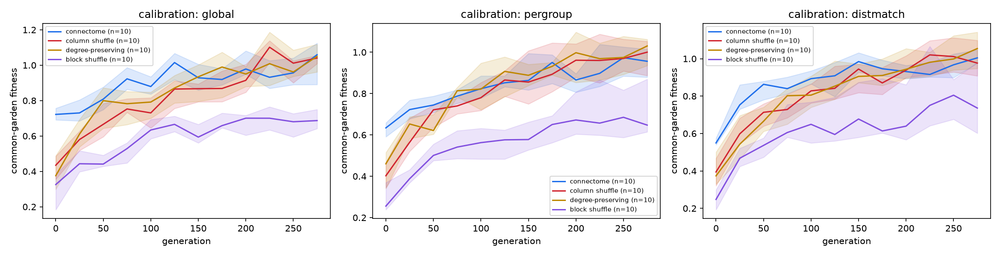
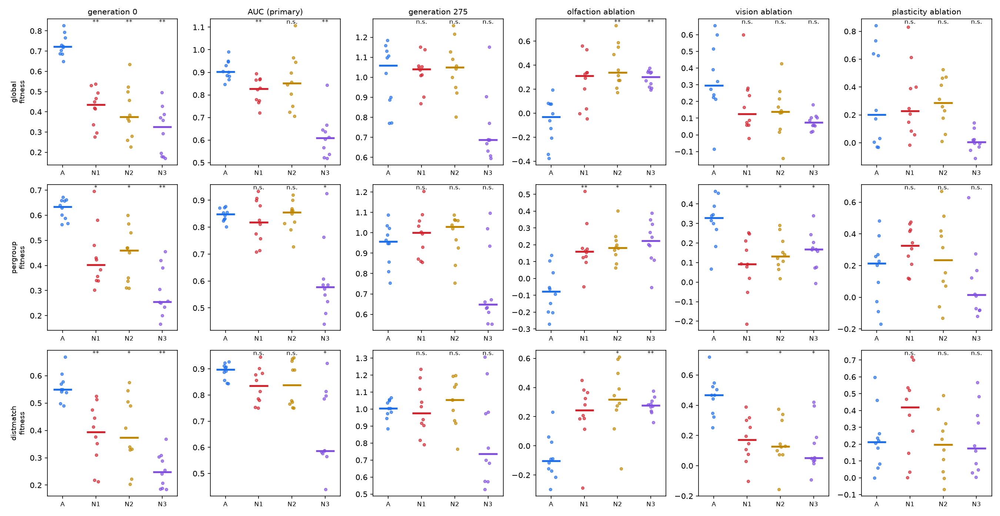
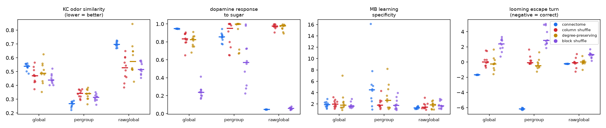
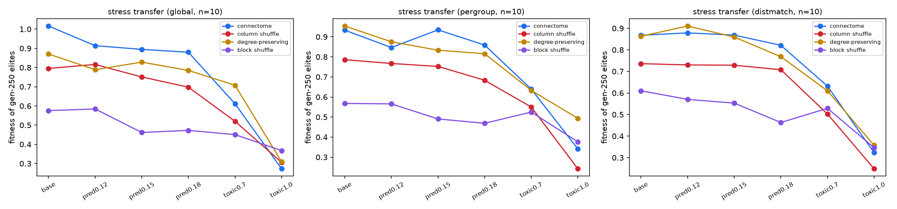

# Supplementary material

**A compressed fly connectome starts ahead but is overtaken by randomised wiring under evolution**, Gyujeong Park

All results in this supplement come from paper-v1 (pre-registered in `PROTOCOL.md`: 4 conditions × 10 seeds × 300 generations, one ecology with toxic probability 0.5, toxic-bite loss 0.4 and a predator pursuing at 0.1·v_max; common garden every 25 generations). Sections S2 and S3 contain the pre-registered paper-v1 endpoints; everything else is post hoc or exploratory and labelled as such. Stored genomes in paper-v1 are population samples, not elites, for the reason given in main-text §2.5; the sample text below uses the older word "elites" for them.

## S1. Calibration schemes

* **global**: W row-normalised to unit absolute input; one global gain and one Kenyon-cell gain found by bisection so mean group activity = 0.15 and mean Kenyon-cell activity = 0.05 over a fixed stimulus ensemble (16 odors × 2 concentrations, single-channel stimuli, one mixed stimulus). Exact convergence for all conditions (relative error 0).
* **pergroup**: per-group multiplicative gain feedback, 150 iterations (the exploratory-phase scheme). Residuals differ by condition (connectome 0.23, nulls 0.02–0.07).
* **rawglobal**: global gain without structural normalisation; circuit analysis only.
* **distmatch**: structural normalisation plus per-group quantile matching to a fixed log-normal reference profile (mean 0.15, SD/mean 0.8), equalising mean, SD and silent fraction. Achieved: mean 0.148–0.149, SD 0.118, sorted-profile error 0.0013 in all four conditions.

### S2 Apparent connectome advantages are calibration-dependent (exploratory)

Circuit properties of initial brains, 4 conditions × 10 seeds per scheme:

* Kenyon-cell odor decorrelation favours the connectome under **pergroup** (10/10 seeds, p_holm = 0.006) and favours the nulls under **global** and **rawglobal** (0–3/10 seeds).
* Dopaminergic responses to sugar and malaise favour the connectome under **global** (10/10, p_holm = 0.006), show no consistent difference under **pergroup**, and favour the nulls under **rawglobal**.
* Mushroom-body learning specificity shows no significant difference in any scheme.
* Looming-escape turn sign is correct in the connectome in 10/10 seeds and beats all three nulls under **global** and **pergroup** (p_holm = 0.006). Under **rawglobal** it beats only N3 (p_holm = 0.006; vs N1 p = 0.275, vs N2 p = 0.129). Laterality is thus the most calibration-robust property, but not significant against every null in every scheme.

An earlier internal result of a 43-fold learning-specificity advantage was traced to a numerically sensitive calibration and is **retracted**; under the robust schemes the ratio is 1.6–3.0 with no significant difference between conditions.

### S3 An innate head start and a different evolved sensory strategy

Pre-registered under **global** and **pergroup**; repeated post hoc under **distmatch**.

| endpoint | global | pergroup | distmatch (post hoc) |
|---|---|---|---|
| generation 0 | A > N1, N2, N3 (10/10, 10/10, 10/10), p_holm 0.006 | A > all (9/10, 10/10, 10/10), p_holm 0.006–0.008 | A > all (10/10, 9/10, 10/10), p_holm 0.006 |
| olfaction ablation | A −0.03 vs +0.31 / +0.34 / +0.30; p_holm 0.006–0.014 | A −0.08 vs +0.16 / +0.18 / +0.22; p_holm 0.006–0.008 | A −0.10 vs +0.25 / +0.32 / +0.28; p_holm 0.006–0.008 |
| vision ablation | A +0.30 vs +0.13 / +0.14 / +0.07; p_holm 0.06–0.11 | A +0.33 vs +0.09 / +0.13 / +0.17; p_holm 0.041 | A +0.47 vs +0.17 / +0.13 / +0.05; p_holm 0.012 |
| generation 275 | no difference vs N1, N2 (p_holm 1.0); vs N3 p_holm 0.059 | no difference vs N1, N2; vs N3 p_holm 0.111 | no difference vs N1, N2; vs N3 p_holm 0.252 |
| AUC (primary) | A > N1, N3 (p_holm 0.006); N2 n.s. | A > N3 only (p_holm 0.012) | A > N3 only (p_holm 0.012) |

Median generation-0 differences are +0.16 to +0.37 fitness units. The head start and the sensory-strategy divergence replicate in all three calibrations, including the one that matches the full activity distribution, so they are not explained by marginal activity statistics. The cumulative endpoint is not robust: the degree-preserving null N2 is never significantly worse on AUC or final fitness.

### S4 No evidence that the nulls' olfactory reliance is associative learning (post hoc)

On generation-250 elites the reversal × plasticity interaction is not significant in any condition or calibration (p_holm 0.39–1.0), and extra toxic bites after an odor reversal do not differ. A plasticity benefit of ≈ 0.09–0.30 exists in all conditions but is not odor-specific. We therefore find **no evidence** that the nulls' olfaction dependence is mediated by odor-specific associative learning; with 10 seeds and the observed confidence intervals a smaller interaction cannot be excluded.

Transfer: with a wider odor plume, connectome elites outperform N1 and N3 under **global** (p_holm = 0.029); under **distmatch** no transfer difference reaches significance, and higher toxicity shows none in any scheme.

### S5 The head start is amplified by, but not reducible to, the engineered reflex (post hoc)

Removing the innate feeding read-out reduces the generation-0 advantage from +0.15…+0.31 to +0.04…+0.08, still significant in all schemes (7–10/10 seeds, p 0.006–0.029). Blinding alone leaves it near its original size (+0.13…+0.30). Removing both vision and the read-out leaves +0.03…+0.07 (8–10/10 seeds, p ≤ 0.029). The random-walk control, with all read-outs zeroed, gives a difference of exactly 0.000 (0/10 seeds) in every scheme, confirming the differences arise through the behavioural pathway and not through the evaluation itself.

### S6 Convergence with the degree-preserving null is not a ceiling artifact (post hoc)

Generation-250 elites re-evaluated in harder worlds without further evolution: at predator speed 0.18 the connectome still beats N1 and N3 (global +0.228 vs N1, 9/10, p = 0.010; distmatch +0.095 vs N1, 8/10, p = 0.027 and +0.342 vs N3, 8/10, p = 0.027) but is never significantly different from N2 at any difficulty or in any scheme. At the most extreme toxicity level the connectome advantage disappears in all schemes.

### S7 Negative result: neuron-level central complex

A module of 1,041 real central-complex neurons (EPG, PEG, PEN, Delta7, PFN, hΔB, FC2, PFL, plus GLNO/LNO/ER interface neurons with measured connectivity) reproduces heading tracking of a rotating visual cue (phase-tracking ratio 1.003; 93 % of EPG variance on a two-dimensional ring). Across ≈ 1,500 pathway-gain settings from random search and an evolution strategy we found none that sustains heading in darkness, integrates angular velocity, or supports decodable path integration, for the connectome and the shuffled control alike. We report this as a limitation of our rate-model formulation, not as a statement about the connectome.

## S8. Figures from paper-v1

**Figure S1.** Common-garden fitness over 300 generations in paper-v1, per calibration scheme (median and interquartile range over 10 seeds).

**Figure S2.** Paper-v1 endpoints per seed: generation 0, AUC (primary), generation 275, and ablation costs.

**Figure S3.** Circuit metrics before evolution under three calibration schemes.

**Figure S4.** Generation-250 samples of paper-v1 tested in harder worlds without further evolution.

## S9. Additional analyses for the ecology grid (post hoc)

Full outputs: `results/eco_analysis.txt` (registered tests), `results/eco_cross.txt` (crossing, cross-ecology, H3), `results/eco_pooled.txt` (across-ecology summaries), `results/mut_analysis.txt` (mutational neighbourhood with confidence intervals), `results/revision_analysis.txt` (sustained crossing, fitness components, absolute ablation costs, population samples against top 16), `results/eco_calib.txt` (activity diagnostics per run).

## S10. Design changes and corrections, in order

The main text reports one correction made after pre-registration (§2.7). For completeness, this section lists every design change that reached the frozen protocols or the reported results, in the order they were made; the full dated log is `RESEARCH_LOG.md` in the repository.

| when | what | effect on reported results |
|---|---|---|
| exploratory phase, before `PROTOCOL.md` | 27 changes to brain construction, calibration and world code (for example: mandatory inclusion of the gustatory-to-dopaminergic path groups; replacement of clustered Kenyon cells by individually wired ones; removal of an energy loophole that let agents survive without eating; a retracted learning-specificity result traced to a numerically unstable calibration) | none of the frozen experiments were run before these changes |
| after `PROTOCOL_ECO.md` was frozen, before any run | the setting meant to remove the predator instead enabled an adaptive predator; fixed and re-frozen before the first grid | none |
| after the first grid | stored genomes were population samples rather than elites, by an indexing error | affects only the post hoc assays of §2.8, as stated there |
| after the first grid (AI-assisted review of draft 1) | one-sided heading noise, §2.7 | the first grid's generation-0 result is not used; all later experiments corrected |
| after the first grid | the standard nulls carry olfactory-to-motor shortcuts, §3.2 | motivated the corrected grid and the intervention |

## S11. Sensitivity analysis: the sham equivalence test on an unregistered outcome

`PROTOCOL_DOSE.md` registered the common-garden probe of §2.6 as the outcome, as `PROTOCOL_ECO.md` does for every experiment in this paper. On that outcome the registered equivalence prediction for the sham fails: sham minus connectome is +0.034 on seed means, 90 % CI −0.062 to +0.123, crossing the ±0.10 bound (§3.5).

The engines also log an in-run fitness at each generation, evaluated in the training worlds rather than in the common-garden batch, and the last of those is generation 599. That outcome was not registered. On it the same difference is −0.022, 90 % CI −0.090 to +0.047, which lies inside the bound and would have supported the prediction. We report this because it is recoverable from the released logs and because the direction of the disagreement is the one that flatters us; it does not govern the registered test, which is the probe.

The disagreement is confined to the sham. Under the unregistered outcome the graded series still rises monotonically (Page's L, z = 5.12, p = 1.5 × 10⁻⁷, per-seed Spearman positive in 10 of 10 seeds) and the generation-0 null still holds (p = 0.98). The swap-matched comparison of §3.5 is likewise unaffected in sign or approximate size.

We did not investigate why the two outcomes differ for the sham specifically. The probe resets its random stream and evaluates 16 agents per island for 8 lifetimes in a fixed sequence of worlds, while the in-run number is the population's fitness in the worlds it was selected in; a condition whose advantage is partly specific to the worlds it evolved in would show the two diverging, but we have not tested that here.

## S12. Sensitivity of the equivalence verdicts to the bound δ (post hoc)

The bound δ = 0.10 was fixed after the first grid (§2.6). Here each registered 90 % interval of the corrected grid (connectome minus control, last probe) is read against other bounds. The smallest symmetric bound an interval satisfies is the larger of its two ends in absolute value. The intervals are read from the file Table 2 is taken from (`results/equivalence.txt`) by `analyze_delta_sens.py`; nothing is recomputed. Equivalence is claimed in the paper only on seed means; the per-ecology rows are shown to make the heterogeneity visible, not as claims.

| cell | control | median | 90 % CI | smallest bound | δ = 0.05 | 0.075 | 0.10 | 0.15 | 0.20 |
|----------|-------|-------|----------------|--------|-----|-----|-----|-----|-----|
| seed mean | N4 | +0.002 | [−0.026, +0.045] | 0.045 | yes | yes | yes | yes | yes |
| seed mean | N5 | −0.074 | [−0.096, +0.002] | 0.096 | no | no | yes | yes | yes |
| P0T0 | N4 | −0.064 | [−0.255, +0.002] | 0.255 | no | no | no | no | no |
| P0T0 | N5 | −0.264 | [−0.368, −0.179] | 0.368 | no | no | no | no | no |
| P1T0 | N4 | +0.021 | [−0.026, +0.038] | 0.038 | yes | yes | yes | yes | yes |
| P1T0 | N5 | +0.067 | [−0.067, +0.090] | 0.090 | no | no | yes | yes | yes |
| P0T1 | N4 | −0.031 | [−0.116, +0.085] | 0.116 | no | no | no | yes | yes |
| P0T1 | N5 | −0.015 | [−0.102, +0.061] | 0.102 | no | no | no | yes | yes |
| P1T1 | N4 | +0.120 | [−0.064, +0.283] | 0.283 | no | no | no | no | no |
| P1T1 | N5 | +0.070 | [−0.009, +0.205] | 0.205 | no | no | no | no | no |

On seed means the N4 verdict holds for every bound down to 0.05. The N5 verdict holds at the registered 0.10 but not at 0.075: it is marginal, and the paper says so. Per ecology the smallest bound ranges from 0.038 (N4, P1T0) to 0.368 (N5, P0T0).

## S13. Extension of the corrected grid to 20 seeds (P0T0 and P1T0)

Seeds 10 to 19 of the two T0 ecologies were run with the corrected grid's frozen engine and flags after rules R1 to R3 were written (research log 46; `analyze_n20.py`). Every one of the 40 runs has the same configuration as seed 0 apart from name and seed. Endpoint: fitness at the last common-garden probe (generation 550); connectome minus control, median with 90 % bootstrap interval; p_holm from Wilcoxon signed-rank tests at n = 20, Holm-corrected across the four controls within each ecology.

| ecology | control | seeds 0–9 | seeds 10–19 | n = 20 | p_holm (n = 20) | inside ±0.10 (R1) |
|---|---|---|---|---|---|---|
| P0T0 | N1 | −0.621 [−0.661, −0.469] | −0.304 [−0.513, −0.161] | −0.491 [−0.624, −0.298] | 0.001 | no |
| P0T0 | N2 | −0.403 [−0.421, −0.308] | +0.100 [−0.068, +0.332] | −0.214 [−0.375, +0.042] | 0.248 | no |
| P0T0 | N4 | −0.064 [−0.255, +0.002] | +0.090 [−0.109, +0.217] | −0.011 [−0.114, +0.080] | 0.841 | no |
| P0T0 | N5 | −0.264 [−0.368, −0.179] | +0.031 [−0.068, +0.152] | −0.104 [−0.208, +0.016] | 0.265 | no |
| P1T0 | N1 | −0.312 [−0.441, −0.197] | −0.417 [−0.522, +0.067] | −0.333 [−0.482, −0.197] | 0.004 | no |
| P1T0 | N2 | −0.338 [−0.530, −0.074] | −0.101 [−0.335, +0.103] | −0.203 [−0.430, −0.032] | 0.046 | no |
| P1T0 | N4 | +0.021 [−0.026, +0.038] | −0.027 [−0.168, +0.050] | +0.003 [−0.042, +0.029] | 1.000 | yes |
| P1T0 | N5 | +0.067 [−0.067, +0.090] | +0.003 [−0.175, +0.144] | +0.056 [−0.097, +0.090] | 1.000 | yes |

**R2 (replication of N5's lead in P0T0 in seeds 10 to 19):** A − N5 = +0.031 [−0.068, +0.152] → **NOT REPLICATED**.

**R3 (two-ecology pool, seed means over P0T0 and P1T0, n = 20; a different estimand from Table 2's four-ecology seed means):**

| control | median [90 % CI] | seeds with connectome ahead | inside ±0.10 |
|---|---|---|---|
| N1 | −0.401 [−0.497, −0.241] | 3/20 | no |
| N2 | −0.155 [−0.273, −0.060] | 4/20 | no |
| N4 | 0.000 [−0.087, +0.083] | 10/20 | yes |
| N5 | −0.059 [−0.093, +0.018] | 7/20 | yes |

**Post hoc checks on the extension (not registered; `analyze_posthoc_n20.py`).** The nulls of seeds 10 to 19 were built like those of seeds 0 to 9: the olfactory-to-descending direct share of the calibrated weights the runs used was 10.41 % (median) for N2 against 10.63 % in seeds 0 to 9, and 0.01 % for N4 and N5. Across the 20 null realisations per ecology this share ranged from about 5 to 17 % but did not predict the null's lead over the connectome (Spearman |ρ| ≤ 0.21, p ≥ 0.38 for N1 and N2 in each ecology; pooled ρ = −0.00 and −0.09). The interventions changed the connectome's share from 0.01 % to 1 to 10 %, a range these realisations do not cover. A rough plug-in simulation from the observed differences suggests that per-ecology equivalence in P0T0 would need on the order of 100 seeds for N4 and is unlikely for N5 at any sample size, so we did not extend further.

## S14. Boundary-targeted sham (PROTOCOL_BSHAM)

Frozen before the runs (research log 54): protocol `PROTOCOL_BSHAM.md`, engine `evo_bsham.py` (`007fa61ff2c6f5c5`), analysis `analyze_bsham.py` (`cbb7f9e1c7aa6192`, unchanged at analysis). Output `results/bsham_key.json`. All 20 runs finished; the analysis's pre-checks passed (configurations equal apart from run, seed and predator speed; 80 boundary-sham constructions complete, shortcut share unchanged, degrees kept; |w(Z→DN)|/|w(ORN→X)| medians 0.92 to 1.05).

| quantity (seed mean over P0T0 and P1T0, n = 10) | mean | 90 % CI | registered rule |
|---|---|---|---|
| P: AS10 − BS10, last probe | +0.600 | [+0.414, +0.797] | lower bound > +0.10 → shortcut-specific |
| R: AS10 − BS10, fresh worlds (4 × 8 lives, generation-599 elites) | +0.639 | [+0.490, +0.792] | same category as P → robust |
| S2: AS10 − BS10, P0T0 / P1T0 | +0.568 / +0.631 | [+0.315, +0.832] / [+0.428, +0.831] | descriptive |
| S3: BS10 − A | +0.007 | [−0.070, +0.086] | ±0.10 reference: inside |
| S4: olfaction-ablation cost AS10 / BS10 | 1.175 / 0.354 | difference +0.821 [+0.563, +1.079] | descriptive |
| S5: AS10 − A | +0.606 | [+0.435, +0.798] | lower bound > 0 → replicated |

S1 (AS*k* − BS*k* increases with dose): 0.158, 0.277, 0.357, 0.600 for 1, 3, 5, 10 %; Page's L = 279, z = 3.18, p = 7.4 × 10⁻⁴ → supported.

**Execution record.** Home workstation (M2 Max, 32 GB), one run at a time. Three runs failed with GPU out-of-memory (`bsham_P0.2_T0.0_s1` twice, `bsham_P0.0_T0.0_s2`, `bsham_P0.0_T0.0_s5`); the causes were the reproduction step holding several population-sized weight copies (peak 30.7 to 33 GB) and, once, another service loading a 12 GB model on the same GPU. One completed attempt was deleted by a driver that misread the log's last line, and one attempt was stopped deliberately to test the memory fix. Every affected run was re-run from scratch with identical flags; no outcome was inspected before re-running (research logs 55 to 57 and 62). The first four runs (`s0` both ecologies, `s1` P0T0, `s2` P1T0) used `evo_bsham.py`; the other 16 used `evo_bsham_mem.py` (`f142f287e671b147`), which adds six forced evaluations in reproduction and is otherwise identical; with probes off it was bit-identical to `evo_bsham.py` on the CPU (peak memory 23.8 GB instead of 30.7 to 33 GB). As for every engine in this project, re-running a seed reproduces the constructions and generation 0 exactly and later generations only in distribution (Section on data and code).

## S15. Corrected grid under distribution-matched calibration (PROTOCOL_DIST2, D-06)

Frozen before the runs: protocol `PROTOCOL_DIST2.md` (`0124b50ad5345279`), analysis `analyze_dist2.py` (`d12b803c141faa1e`, unchanged at analysis), the corrected grid's frozen engine `evo_fix.py` and flags with `--homeo distmatch` in place of `global`. All 40 runs (4 ecologies × seeds 0–9) finished; each configuration equals its global-calibration counterpart apart from run name and calibration. Output `results/dist2_key.json`.

**Manipulation check** (registered: at least 36 of 40 runs with |SD − SD_A| ≤ 0.01, |silent − silent_A| ≤ 10 and |saturated − saturated_A| ≤ 0.02 for N4 and N5): 40/40 runs → PASSED. Calibrated activity by condition, medians over the 40 runs:

| condition | between-group SD | silent groups | Kenyon-cell mean |
|---|---|---|---|
| A | 0.118 | 7 | 0.050 |
| N1 | 0.118 | 3 | 0.050 |
| N2 | 0.118 | 6.5 | 0.050 |
| N4 | 0.118 | 4.5 | 0.050 |
| N5 | 0.118 | 4.5 | 0.050 |

Under global calibration the same quantities were SD 0.163 / 46 silent groups for the connectome against 0.080–0.087 / 8–19 for the controls (main text); distribution matching removes that difference. N1's Kenyon-cell mean ranged 0.038–0.050 (a known limitation of the scheme for the column shuffle).

**P1 and P2 — seed means over four ecologies, median with 90 % bootstrap interval:**

| contrast | global (registered grid) | distribution-matched | verdict |
|---|---|---|---|
| A − N4 | +0.002 [−0.026, +0.045] | +0.055 [+0.035, +0.097] | EQUIVALENT |
| A − N5 | −0.074 [−0.096, +0.002] | −0.009 [−0.076, +0.046] | EQUIVALENT |
| A − N1 | −0.224 [−0.337, −0.103] | −0.274 [−0.306, −0.123] | BEHIND |
| A − N2 | −0.199 [−0.321, −0.133] | −0.146 [−0.231, −0.037] | BEHIND |

**S1 — change caused by calibration, seed mean of (A − N) under distribution matching minus (A − N) under global:**

| control | change | verdict |
|---|---|---|
| N1 | +0.010 [−0.112, +0.072] | UNDETERMINED |
| N2 | +0.101 [+0.016, +0.133] | CHANGED |
| N4 | +0.062 [−0.002, +0.117] | UNDETERMINED |
| N5 | +0.076 [−0.017, +0.128] | UNDETERMINED |

**S2 — N5 ahead of the connectome in P0T0 under distribution matching:** A − N5 = −0.066 [−0.320, +0.124] → NOT REPLICATED.

**Per ecology (descriptive), A minus control, median [90 % CI]:**

| ecology | control | global | distribution-matched |
|---|---|---|---|
| P0T0 | N1 | −0.621 [−0.661, −0.469] | −0.437 [−0.563, −0.235] |
| P0T0 | N2 | −0.403 [−0.421, −0.308] | −0.478 [−0.677, −0.052] |
| P0T0 | N4 | −0.064 [−0.255, +0.002] | +0.139 [−0.128, +0.230] |
| P0T0 | N5 | −0.264 [−0.368, −0.179] | −0.066 [−0.320, +0.124] |
| P1T0 | N1 | −0.312 [−0.441, −0.197] | −0.489 [−0.664, −0.275] |
| P1T0 | N2 | −0.338 [−0.530, −0.074] | −0.164 [−0.483, −0.013] |
| P1T0 | N4 | +0.021 [−0.026, +0.038] | +0.051 [−0.120, +0.144] |
| P1T0 | N5 | +0.067 [−0.067, +0.090] | +0.041 [−0.204, +0.214] |
| P0T1 | N1 | −0.159 [−0.205, +0.010] | −0.096 [−0.182, +0.010] |
| P0T1 | N2 | −0.017 [−0.333, +0.005] | −0.020 [−0.122, +0.096] |
| P0T1 | N4 | −0.031 [−0.116, +0.085] | +0.073 [−0.066, +0.104] |
| P0T1 | N5 | −0.015 [−0.102, +0.061] | +0.036 [−0.086, +0.089] |
| P1T1 | N1 | +0.054 [−0.054, +0.127] | +0.063 [−0.040, +0.099] |
| P1T1 | N2 | +0.015 [−0.132, +0.137] | +0.104 [−0.091, +0.111] |
| P1T1 | N4 | +0.120 [−0.064, +0.283] | −0.012 [−0.099, +0.073] |
| P1T1 | N5 | +0.070 [−0.009, +0.210] | −0.027 [−0.066, +0.078] |
